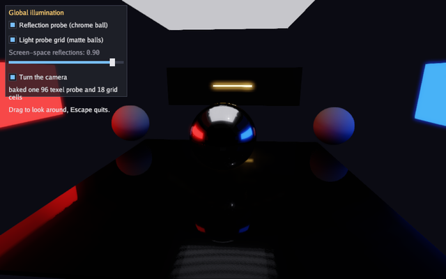

A scene used to have one environment for everything in it, so a ball in a
red room reflected the sky outside it. This program is the three ways
past that. A reflection probe is baked inside the room, so the chrome
ball mirrors the walls around it and the polished floor carries the red
wall down one side. A grid of light probes is baked across the floor, so
the matte ball by the red wall takes red light and the one by the blue
wall takes blue. Screen-space reflections put what is above the floor
back into it, including the glowing bar the probes are too coarse to
place.

Nothing in the room is lit from outside: the walls, the ceiling panel and
the bar are their own light, and the only way that light reaches a ball
is through a bake. Turning all three checkboxes off leaves the scene as
the engine drew it before, which is a dark room with three unlit balls in
it.

The engine area is the 3D half of [gfx](../pkg/gfx.html). Read
[the 3D graphics guide](../guides/graphics-3d.html) for the whole
lighting picture, and its global illumination section for what a probe
holds and what it costs.

Run it:

```bash
go run ./examples/probes -seconds 3 -shot out.png
```

The flags are `-seconds N` and `-shot file.png`. Dragging turns the
camera, the checkboxes turn each kind of light on and off, and Escape
quits.



## Package and state

The two constants are the room: a box of half-width `room` metres and
`tall` metres high. 3D distances have no fixed unit, but the lighting is
tuned for metres.

The game holds the two meshes it draws everything from, the probe and the
grid it bakes in `Init`, and the checkbox state. `roomLight` is kept on
the game because the bakes and the frames have to set the same light: a
probe holds what the scene looked like when it was baked, so a bake lit
differently from the frame is a probe that disagrees with the screen.

```go
// Command probes shows the light a scene has beyond one environment map:
// a reflection probe baked inside a room, so the chrome ball mirrors the
// walls around it instead of the sky; a grid of light probes, so the
// matte balls take the colour of the wall they stand by; and screen-space
// reflections on the polished floor, so what is above it appears in it.
// Each one has a checkbox, and turning all three off leaves the scene
// with the single environment the engine had before.
package main

import (
	"flag"
	"fmt"
	"os"

	"golang.org/x/image/font/gofont/goregular"

	"github.com/matjam/bunyip"
	"github.com/matjam/bunyip/gfx"
	"github.com/matjam/bunyip/input"
	"github.com/matjam/bunyip/lin"
	"github.com/matjam/bunyip/ui"
)

// The room is a box of half-width room and height tall, with the probe
// captured at eye level in the middle of it.
const (
	room = 9.0
	tall = 5.0
)

type game struct {
	seconds  float64
	shot     string
	shotDone bool

	font   *gfx.Font
	ui     *ui.Context
	cube   *gfx.Mesh
	sphere *gfx.Mesh

	probe *gfx.ReflectionProbe
	grid  *gfx.LightProbeGrid

	post      gfx.PostSettings
	useProbe  bool
	useGrid   bool
	reflect   float32
	yaw       float32
	baked     string
	spinning  bool
	roomLight gfx.Light
}
```

## Init: baking the probe and the grid

`gfx.ReflectionProbe` is a position, a volume and a resolution.
`Extent` is the box's half-size, so this one covers the whole room;
`Margin` fades the probe's reflection back towards the frame's own
environment in the last metre of the volume, so a ball carried out of the
room does not change reflection in one step. `BoxProjection` reflects
each wall at the place the wall is rather than at infinity, which is what
puts the red wall down one side of the floor instead of over all of it.

`BakeProbe` renders the scene six times from the probe's position and
prefilters what it saw for every roughness. It runs its own command
buffers and waits for them, so it belongs in `Init` or `Update` and not
in `Draw`. The function it takes queues the scene the bake sees, exactly
as `Draw` would; here it is the same `drawRoom` every frame calls.

`gfx.LightProbeGrid` is a lattice: an origin, a spacing and how many
cells on each axis. `BakeLightProbes` renders a small cube at every cell
and keeps the irradiance around it as nine spherical harmonics, so
eighteen cells here cost eighteen little renders once. `Resolution` can
be small because harmonics keep only the low frequencies of what the cell
saw.

`PostSettings.ReflectionSteps` and `ReflectionDistance` tune the
screen-space reflection ray; `Reflections` is the strength, which the
slider drives each frame.

```go
func (g *game) Init(ctx *bunyip.Context) error {
	gr := ctx.Gfx
	var err error
	if g.font, err = gr.NewFont(goregular.TTF, 15, gfx.FontOptions{}); err != nil {
		return err
	}
	g.ui = ui.New(gr, ui.DarkTheme(g.font))
	cv, ci := gfx.CubeMesh()
	if g.cube, err = gr.NewMesh(cv, ci); err != nil {
		return err
	}
	sv, si := gfx.SphereMesh(24, 48)
	if g.sphere, err = gr.NewMesh(sv, si); err != nil {
		return err
	}
	// The light in the room is the glow of its own walls, so everything the
	// balls are lit by has to be baked to be seen at all.
	g.roomLight = gfx.Light{Direction: lin.V3(-0.3, -1, -0.2), Color: gfx.Color{R: 0.15, G: 0.15, B: 0.17, A: 1},
		Sky: gfx.Sky{Vacuum: 1}}
	// One reflection probe for the whole room, captured at eye level. The
	// box projection reflects each wall where the wall is, so the floor
	// carries the red wall down its near edge rather than everywhere.
	g.probe = &gfx.ReflectionProbe{
		Position: lin.V3(0, 1.8, 0), Extent: lin.V3(room, tall/2, room),
		Margin: 1, Resolution: 96, BoxProjection: true,
	}
	if err := gr.BakeProbe(g.probe, func() { g.drawRoom(gr) }); err != nil {
		return err
	}
	// A grid of irradiance across the floor of the room: three by two by
	// three cells is enough for walls this far apart.
	g.grid = &gfx.LightProbeGrid{
		Origin: lin.V3(-room+3, 0.9, -room+3), Spacing: lin.V3(room-3, 2, room-3),
		Counts: [3]int{3, 2, 3}, Resolution: 24,
	}
	if err := gr.BakeLightProbes(g.grid, func() { g.drawRoom(gr) }); err != nil {
		return err
	}
	g.baked = fmt.Sprintf("baked one %d texel probe and %d grid cells", g.probe.Resolution, 3*2*3)
	ctx.Log.Info("probes: " + g.baked)
	g.post = gfx.DefaultPost()
	g.post.Bloom = 0.4
	// Sixty-four steps over fifteen metres keeps the reflected bar sharp
	// on a floor this size; the defaults are thirty-two over thirty.
	g.post.ReflectionSteps = 64
	g.post.ReflectionDistance = 15
	g.useProbe, g.useGrid, g.reflect, g.spinning = true, true, 0.9, true
	return nil
}
```

## Shutdown

A probe owns the cube map its bake made, so it is destroyed like any
other GPU resource. A grid holds its harmonics in ordinary memory and
needs nothing.

```go
func (g *game) Shutdown(ctx *bunyip.Context) {
	g.probe.Destroy()
	g.sphere.Destroy()
	g.cube.Destroy()
	g.font.Destroy()
}
```

## Update: the camera and the screenshot

Dragging turns the camera and the checkbox spins it otherwise.
`g.ui.WantsMouse()` keeps a drag on a slider from also turning the view.
The `-seconds` and `-shot` flags every example takes are handled here.

```go
func (g *game) Update(ctx *bunyip.Context) error {
	in := ctx.Input
	if in.KeyPressed(input.KeyEscape) || (g.seconds > 0 && ctx.Time >= g.seconds) {
		ctx.Quit()
	}
	if g.shot != "" && !g.shotDone && (g.seconds == 0 || ctx.Time >= g.seconds/2) {
		ctx.Screenshot(g.shot)
		g.shotDone = true
	}
	if in.MouseDown(input.MouseLeft) && !g.ui.WantsMouse() {
		dx, _ := in.MouseDelta()
		g.yaw += float32(dx) * 0.01
	} else if g.spinning {
		g.yaw += float32(ctx.Delta) * 0.25
	}
	return nil
}
```

## The room

One function draws the room, and both bakes and every frame call it, so
what the probes hold is what the camera sees. The floor is nearly smooth,
which is what gives the screen-space reflections something to land on.
The red and blue walls carry `Emissive`, so they are the light in the
room rather than surfaces lit by something else; a bake is the only way
that light reaches anything.

```go
// drawRoom queues the room itself: the walls, the floor and the light in
// it. Both bakes and every frame draw it, so what the probes hold is what
// the camera sees.
func (g *game) drawRoom(gr *gfx.Graphics) {
	gr.SetLight(g.roomLight)
	// A polished floor, so the screen-space reflections have something to
	// land on, and a dim ceiling panel to light the room from above.
	gr.DrawMesh(g.cube, gfx.Material{BaseColor: gfx.RGB(40, 42, 48), Roughness: 0.06, Metallic: 0.1},
		lin.Translate(lin.V3(0, -0.1, 0)).Mul(lin.Scale(lin.V3(room, 0.1, room))))
	gr.DrawMesh(g.cube, gfx.Material{BaseColor: gfx.RGB(220, 220, 230), Emissive: 0.6},
		lin.Translate(lin.V3(0, tall, 0)).Mul(lin.Scale(lin.V3(room*0.5, 0.1, room*0.5))))
	// Four walls: one glowing red, one glowing blue, two grey. The glow is
	// the whole light of the room, so a bake is the only way anything gets
	// its colour.
	walls := []struct {
		at    lin.Vec3
		size  lin.Vec3
		color gfx.Color
		glow  float32
	}{
		{lin.V3(-room, tall/2, 0), lin.V3(0.1, tall/2, room), gfx.RGB(230, 40, 40), 2.5},
		{lin.V3(room, tall/2, 0), lin.V3(0.1, tall/2, room), gfx.RGB(40, 90, 230), 2.5},
		{lin.V3(0, tall/2, -room), lin.V3(room, tall/2, 0.1), gfx.RGB(120, 120, 125), 0},
		{lin.V3(0, tall/2, room), lin.V3(room, tall/2, 0.1), gfx.RGB(120, 120, 125), 0},
	}
	for _, w := range walls {
		gr.DrawMesh(g.cube, gfx.Material{BaseColor: w.color, Emissive: w.glow, Roughness: 0.8},
			lin.Translate(w.at).Mul(lin.Scale(w.size)))
	}
	// A bright bar standing on the floor: the object the floor reflects.
	gr.DrawMesh(g.cube, gfx.Material{BaseColor: gfx.RGB(255, 210, 120), Emissive: 4},
		lin.Translate(lin.V3(0, 2.6, -room+1)).Mul(lin.Scale(lin.V3(2.5, 0.12, 0.12))))
}
```

## Draw: adding the probes to the frame

`AddProbe` adds a baked probe to the frame, the way `AddPointLight` adds
a light: a draw whose centre falls inside the probe's volume reflects it,
and everything outside every probe keeps the light's own environment or
sky. `SetLightProbes` hands the frame a baked grid, which replaces the
single ambient term where the grid reaches and fades back to it at the
edge.

The chrome ball shows the probe, since a mirror shows nothing but its
reflection. The two matte balls show the grid, since a rough surface
shows nothing but its irradiance. The floor shows the screen-space
reflections, which the slider turns down to nothing.

```go
func (g *game) Draw(ctx *bunyip.Context) error {
	gr := ctx.Gfx
	g.post.Reflections = g.reflect
	gr.SetPost(g.post)
	// The camera stays inside the room, where the walls it reflects are.
	gr.SetCamera(gfx.OrbitCamera(lin.V3(0, 1.2, 0), g.yaw, 0.26, 8))
	g.drawRoom(gr)
	if g.useProbe {
		gr.AddProbe(g.probe)
	}
	if g.useGrid {
		gr.SetLightProbes(g.grid)
	}
	// A chrome ball in the middle takes its reflection from the probe, and
	// two matte balls by the coloured walls take their light from the grid.
	gr.DrawMesh(g.sphere, gfx.Material{BaseColor: gfx.White, Metallic: 1, Roughness: 0.05},
		lin.Translate(lin.V3(0, 1.3, 0)).Mul(lin.Scale(lin.V3(1.1, 1.1, 1.1))))
	for _, x := range []float32{-room + 4, room - 4} {
		gr.DrawMesh(g.sphere, gfx.Material{BaseColor: gfx.RGB(230, 230, 230), Roughness: 0.9},
			lin.Translate(lin.V3(x, 0.9, -4)).Mul(lin.Scale(lin.V3(0.9, 0.9, 0.9))))
	}

	u := g.ui
	u.Begin(ctx.Input, func() {
		u.Panel("Global illumination", ui.Rect{X: 12, Y: 12, W: 280, H: 210}, func() {
			u.Checkbox("Reflection probe (chrome ball)", &g.useProbe)
			u.Checkbox("Light probe grid (matte balls)", &g.useGrid)
			u.Slider("Screen-space reflections", &g.reflect, 0, 1)
			u.Checkbox("Turn the camera", &g.spinning)
			u.Label(g.baked)
			u.Label("Drag to look around, Escape quits.")
		})
	})
	return nil
}
```

## main

The flags and `bunyip.Run`, as every example has them.

```go
func main() {
	seconds := flag.Float64("seconds", 0, "exit after this many seconds")
	shot := flag.String("shot", "", "write a screenshot to this PNG")
	flag.Parse()
	err := bunyip.Run(bunyip.Config{Title: "Bunyip probes", Width: 1024, Height: 640, Resizable: true, Validation: true},
		&game{seconds: *seconds, shot: *shot})
	if err != nil {
		fmt.Fprintln(os.Stderr, "probes:", err)
		os.Exit(1)
	}
}
```
