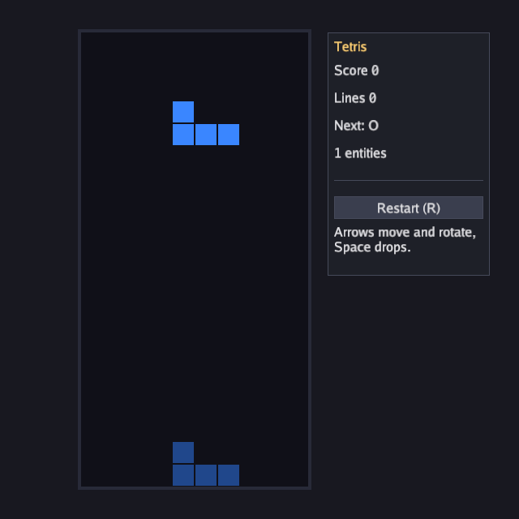

In this guide you write Tetris from an empty file on top of the engine's
[entity component system](ecs.html). It uses the loop, input, drawing,
the timer and tween packages, the UI and the mixer. The finished program
is `examples/tetris` in the repository; run it with
`go run ./examples/tetris`.



## 1. Entities, resources and events

Tetris has two kinds of thing on the board: blocks that have settled,
and the one piece the player is steering. Both become entities. A
settled block is a `Cell`; the piece is a `Falling`:

```go
// Cell is one settled block on the board.
type Cell struct{ X, Y, Kind int }

// Falling is the piece the player controls; there is one at a time.
type Falling struct {
	Kind  int
	Cells [][]bool // Cells[y][x]
	X, Y  int
}
```

Anything the game has exactly one of is a *resource* on the world
rather than an entity: the score, the occupancy grid, this update's
controls, the gravity clock and the bag of upcoming pieces.

```go
type Board struct{ Full [rows][cols]bool }
type Score struct {
	Points, Lines int
	Over          bool
}
type Controls struct{ Left, Right, Rotate, Down, Drop bool }
type Clock struct {
	Timers timer.Scheduler
	Drop   timer.Handle
}
type Bag struct {
	Random *rng.Rand
	Next   int
}
```

Two *events* let the game logic report what happened to the effects
code without referring to it:

```go
type Locked struct{}          // a piece settled without clearing lines
type Cleared struct{ Rows int } // lines were removed
```

## 2. Pieces that rotate

The seven shapes are strings, `#` for a filled cell, with a colour from
`gfx.Hex`. Rotation is a transpose with a flip over a square grid:

```go
var shapes = []struct {
	name  string
	cells []string
	color gfx.Color
}{
	{"I", []string{"....", "####", "....", "...."}, gfx.Hex(0x5BC0EB)},
	{"O", []string{"##", "##"}, gfx.Hex(0xFDE74C)},
	{"T", []string{".#.", "###", "..."}, gfx.Hex(0x9B5DE5)},
	// S, Z, J, L ...
}

func (p Falling) rotated() Falling {
	n := len(p.Cells)
	out := Falling{Kind: p.Kind, X: p.X, Y: p.Y, Cells: make([][]bool, n)}
	for y := range n {
		out.Cells[y] = make([]bool, n)
		for x := range n {
			out.Cells[y][x] = p.Cells[n-1-x][y]
		}
	}
	return out
}
```

Most of the rules reduce to whether a piece fits, which `fits` answers
against the `Board` resource:

```go
func fits(b *Board, p Falling) bool {
	for y, row := range p.Cells {
		for x, on := range row {
			if !on {
				continue
			}
			bx, by := p.X+x, p.Y+y
			if bx < 0 || bx >= cols || by >= rows || (by >= 0 && b.Full[by][bx]) {
				return false
			}
		}
	}
	return true
}
```

## 3. The world and its systems

`Init` creates the world, keeps two queries (one per component type)
and registers the systems in the order they should run:

```go
w := ecs.NewWorld()
g.cells = ecs.NewQuery1[Cell](w)
g.falling = ecs.NewQuery1[Falling](w)
w.AddSystem("board", boardSystem)
w.AddSystem("input", inputSystem)
w.AddSystem("gravity", gravitySystem)
w.AddSystem("effects", g.effectsSystem(ctx.Audio))
```

The first system rebuilds the occupancy grid from the `Cell` entities,
so the others test collisions against a plain array. Walking two
hundred cells is a small, bounded scan. Rebuilding the grid brings it into
agreement with the entities at that point; code that changes cells later
in the update must rebuild it again before testing occupancy:

```go
func boardSystem(w *ecs.World, dt float64) {
	b := ecs.Resource[Board](w)
	b.Full = [rows][cols]bool{}
	ecs.Each(w, func(e ecs.Entity, c *Cell) {
		if c.Y >= 0 {
			b.Full[c.Y][c.X] = true
		}
	})
}
```

## 4. Input as a resource

`ctx.Input` lives outside the world, so each `Update` copies the key
presses the game uses into the `Controls` resource and then runs the
systems. The input system is then a function of the world alone, which
makes it testable and, later, replayable:

```go
func (g *game) Update(ctx *bunyip.Context) error {
	in := ctx.Input
	*ecs.Resource[Controls](g.world) = Controls{
		Left: in.KeyPressed(input.KeyLeft), Right: in.KeyPressed(input.KeyRight),
		Rotate: in.KeyPressed(input.KeyUp), Down: in.KeyPressed(input.KeyDown),
		Drop: in.KeyPressed(input.KeySpace),
	}
	g.world.Update(ctx.Delta)
	return nil
}
```

The input system fetches the one falling piece with `First` and tries
moves. Rotation tries a few horizontal nudges so a piece against the
wall still turns, the "wall kick" players expect:

```go
func inputSystem(w *ecs.World, dt float64) {
	in := ecs.Resource[Controls](w)
	_, p, ok := ecs.NewQuery1[Falling](w).First()
	if !ok {
		return
	}
	if in.Left {
		c := *p
		c.X--
		try(w, p, c)
	}
	if in.Rotate {
		r := p.rotated()
		for _, dx := range []int{0, -1, 1, -2, 2} {
			r.X = p.X + dx
			if try(w, p, r) {
				break
			}
		}
	}
	if in.Drop {
		for {
			c := *p
			c.Y++
			if !try(w, p, c) {
				break
			}
		}
		lockPiece(w)
	}
	// ...
}
```

## 5. Gravity on a timer

The piece should fall every 600 ms whatever the frame rate. A
[timer.Scheduler](../pkg/timer.html) in the `Clock` resource runs a
callback on game time, and the gravity system advances it:

```go
clock.Drop = clock.Timers.Every(0.6, func() { drop(w) })

func gravitySystem(w *ecs.World, dt float64) {
	ecs.Resource[Clock](w).Timers.Update(dt)
}

func drop(w *ecs.World) {
	_, p, ok := ecs.NewQuery1[Falling](w).First()
	c := *p
	c.Y++
	if ok && !try(w, p, c) {
		lockPiece(w)
	}
}
```

## 6. Locking and clearing lines

When the piece cannot fall, its cells become `Cell` entities and the
piece entity is despawned. Then every full row is removed: the row's
cells are despawned and every cell above moves down one. Despawning the
entity a query is visiting is safe, so this is one pass per row:

```go
func lockPiece(w *ecs.World) {
	e, p, _ := ecs.NewQuery1[Falling](w).First()
	for y, row := range p.Cells {
		for x, on := range row {
			if on && p.Y+y >= 0 {
				w.SpawnWith(Cell{X: p.X + x, Y: p.Y + y, Kind: p.Kind})
			}
		}
	}
	w.Despawn(e)
	boardSystem(w, 0)
	b := ecs.Resource[Board](w)
	cleared := 0
	for y := rows - 1; y >= 0; y-- {
		full := true
		for x := range cols {
			full = full && b.Full[y][x]
		}
		if !full {
			continue
		}
		ecs.Each(w, func(e ecs.Entity, c *Cell) {
			switch {
			case c.Y == y:
				w.Despawn(e)
			case c.Y < y:
				c.Y++
			}
		})
		boardSystem(w, 0)
		cleared++
		y++ // re-check the row that fell into this slot
	}
	if cleared > 0 {
		s := ecs.Resource[Score](w)
		s.Lines += cleared
		s.Points += []int{0, 100, 300, 500, 800}[cleared]
		ecs.Emit(w, Cleared{Rows: cleared})
	} else {
		ecs.Emit(w, Locked{})
	}
	spawnPiece(w)
}
```

The game logic never mentions sound or animation. It emits an event and
does nothing else.

## 7. Effects from events

The effects system runs last. It reads the events the earlier systems
emitted and turns them into a sound and a flash. The tones are
synthesised at start with `audio.Sine`, so the game has no sound files,
and a [tween](../pkg/tween.html) drives the flash from full to nothing
over 0.4 s:

```go
func (g *game) effectsSystem(mixer *audio.Mixer) ecs.System {
	return func(w *ecs.World, dt float64) {
		for range ecs.Events[Locked](w) {
			mixer.Play(g.lock, audio.PlayOptions{Volume: 0.4})
		}
		for _, ev := range ecs.Events[Cleared](w) {
			mixer.Play(g.clear, audio.PlayOptions{Volume: 0.5, Pitch: 1 + 0.2*float32(ev.Rows)})
			g.flash = tween.New(1, 0, 0.4, tween.OutQuad)
		}
		if g.flash != nil {
			if g.flash.Update(float32(dt)); g.flash.Done() {
				g.flash = nil
			}
		}
	}
}
```

## 8. Drawing

The board and blocks are drawn as filled rectangles. `Draw` walks the cells
query, then draws a translucent ghost where the piece will land and the
piece itself:

```go
g.cells.Each(func(e ecs.Entity, c *Cell) {
	if c.Y >= 0 {
		drawCell(c.X, c.Y, c.Kind, 1)
	}
})
if _, p, ok := g.falling.First(); ok {
	ghost := *p
	for fits(ecs.Resource[Board](w), ghost) {
		ghost.Y++
	}
	ghost.Y--
	// draw ghost at alpha 0.25, then *p at alpha 1 ...
}
if g.flash != nil {
	gr.FillRect(ox, oy, cols*cell, rows*cell, gfx.Color{R: 1, G: 1, B: 1, A: 0.35 * g.flash.Value()})
}
```

## 9. A score panel with the UI

The [ui](../pkg/ui.html) package is immediate mode: build the panel
every frame inside `Begin`, and widgets report what happened.
Containers take closures, so their extent is visible in the code:

```go
score := ecs.Resource[Score](w)
u.Begin(ctx.Input, func() {
	u.Panel("Tetris", ui.Rect{X: ox + cols*cell + 24, Y: oy, W: 200, H: 300}, func() {
		u.Label(fmt.Sprintf("Score %d", score.Points))
		u.Label(fmt.Sprintf("Lines %d", score.Lines))
		u.Label(fmt.Sprintf("%d entities", w.Count()))
		if score.Over {
			u.Label("Game over")
		}
		if u.Button("Restart (R)") {
			g.restart()
		}
	})
})
```

## 10. Running and shipping

The finished source is in `examples/tetris/main.go`. It accepts the
`-seconds` and `-shot` flags used by the screenshot examples, so a script can run it
and save a screenshot:

```
go run ./examples/tetris -seconds 3 -shot tetris.png
```

To hand it to someone, build it and wrap it:

```
go build -o tetris ./examples/tetris
go run ./cmd/bunyip-bundle -name Tetris -exe ./tetris -o dist
```

## Where to take it

- Hold a piece: a `Held` resource and a swap in the input system.
- Levels: cancel and re-create the gravity timer with a shorter interval
  as `Score.Lines` grows.
- Two players: a second `Falling` entity and a `Player` component on
  cells, with queries filtered by `With[PlayerOne]()`.
- Replays: record `Controls` per update along with the initial random
  seed and reset timing, then replay them with the same simulation step
  and rules. Keep external effects such as audio separate from the rules.
- Music: stream a file with `ctx.Audio.OpenMusic` and `PlayStream`, or
  write a `Stream` that synthesises it, as `examples/audio` does.
